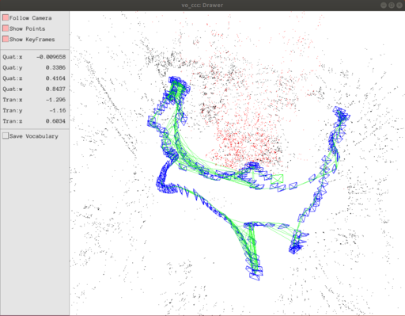
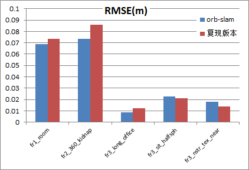
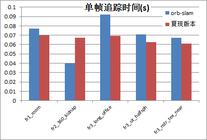

# 背景
本项目内容是按照自己的理解复现[orb-slam](https://github.com/raulmur/ORB_SLAM2)代码，希望透过代码复现理解系统运行逻辑及算法原理。

# 概述
复现版本系统界面：

# 复现效果
<效果概述>  
复现系统的精度及实时性与orb-slam相当。（仅对于测试的[TUM RGBD数据集](https://vision.in.tum.de/data/datasets/rgbd-dataset/download)而言）

<评估方法>  
1. 使用RMSE评估追踪精度，使用单帧追踪时间评估实时性。（使用TUM评估工具）
2. 选择TUM RGBD数据集中有代表性的场景作为测试集。
3. 考虑到测试结果会有波动，每个测试集运行5次，除去最大值和最小值，取剩余三次的平均值。

<详细内容>
* 数据集选择

| 数据集名称 | 场景特点 | 验证内容 |
|:----------|:--------------|:------|
| fr1_room | 存在回环 | 回环检测 |
| fr2_360_kidnap | 传感器输入中断 | 重定位 |
| fr3_long_office | 时间跨度长 | 累积误差 |
| fr3_sit_halfsph | 慢速移动 动态场景 | 动态场景定位 |
| fr3_nstr_tex_near | 无结构特征 有纹理 | 无结构场景定位 |

* 测试结果

# 相对orb-slam变化点
使用不同的库函数，基于自己的理解进行代码复现。  
相对orb-slam在**系统功能**、**系统组成**和**代码实现**上略有区别。  
## 系统功能
复现版本选择RGBD相机作为传感器，并增加依据追踪结果创建字典的功能（首次创建时还是需要载入完整的orb字典）。  

| 项目 | orb-slam | 复现版本 |
|:----------|:--------------|:------|
| 传感器类型 | 单目/双目/RGBD | RGBD |
| DBow字典  | 未提供创建功能  | 可依据场景创建 |

## 系统组成
模块与orb-slam相同，按照追踪、局部地图、回环检测、绘图4个线程进行划分。  
源文件中类的定义及数量有调整，新增camera类，config，合并绘图类等。

| 变化 | orb-slam | 复现版本 | 变化原因 |
|:----------|:--------------|:------|:-------|
| 新增 | - | Config & Camera | 配置和相机信息修改便利 |
| 删除 | Initializer | - | RGBD无需单独初始化 |
| 删除 | PnPsolver | - | 调用opencv内置函数实现 |
| 合并 | FrameDrawer & MapDraw & Viewer | Drawer | 功能整合 |
| 合并 | KeyFrameDatabase & Map | Map | 功能整合 |

## 代码实现
使用的库函数有以下变化：
* 矩阵运算：cv::Mat -> Eigen矩阵类 & Sophus
* 后端优化：g2o -> ceres

主要的代码工作：
* 按照自己理解的系统运行逻辑全部重写了除orb特征提取以外的所有代码。  
* 将原版中基于g2o的图优化模型转换为非线性最小二乘问题模型，使用Ceres建模并求解。  
* 使用旋转向量实现基于李代数的点坐标变换函数并在优化时使用，与调用Sophus库函数相比，优化速度显著提升。
* 可依据场景生成对应字典，在保证重定位和回环检测精度的基础上，减小存储空间，提高加载速度。
